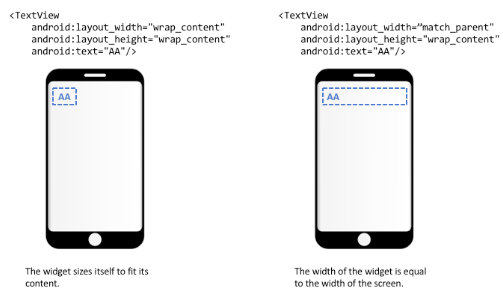

# Exam Revision

### Nested Classes

A nested class that is not declared static is called an Inner Class

- To instantiate an inner class, you need an instance of outer class which is usually called enclosing class
- The inner class can access all methods and variables of the enclosing outer class

```java
public class OuterClass {     
	int a;     
	OuterClass(){ a = 10; } 
	void  outerPrintA (){ System.out.println(a); } 
	
	class InnerClass { 
		int c; 
		InnerClass(){ c = 100; } 
		void  innerPrintA(){ System.out.println(a); }
		OuterClass giveBackOuter(){ return OuterClass.this; }     
	}
}
```

```java
public class TestOuterClass   { 
    public static void  main (String[] args) { 
        //Instantiate   OuterClass  
        OuterClass outerClass = new OuterClass(); 
        //Instantiate   the   InnerClass 
        OuterClass.InnerClass innerClass =outerClass.new InnerClass();
        System.out.println(innerClass.c);       // 100
        innerClass.innerPrintA();               // 10
        System.out.println(innerClass.giveBackOuter()); // OuterClass@49476842
    }
}
```

### Static Nested Class

By declaring a nested class as Static, it is known as a static nested class

- Only access static variables and methods in outer class
- Instantiated without an instance of the outer class

Static nested class behaves like a top-level class and is a way to organise classes that are used only be some other classes.

```java
OuterClass.StaticNestedClass nestedObj = new OuterClass.StaticNestedClass();
```

### Static inner class

Can be used to model data

```java
public class DataSource   {     
	private   ArrayList<CardData>   dataArrayList; 
	//rest   of   class   not   shown   -- 
	static class CardData { 
		private   String   name; 
		private   String   path; 
		//constructors   and   getters   not   shown     
	} 
}
```

DataSource is a class meant to contain data displayed in RecyclerView

private ArrayList variable will hold instances of CardData, a static inner class

Each instance of CardData is meant to hold information for one image

### Nested Interface & Anonymous Classes

We can nest interfaces which are inherently static. Any object that implements Foo.Bar interface can be passed to thirsty()

```java
public class Foo    { 
    interface Bar { 
        void  drink ();     
    }   

    Foo(){     
    } 

    void  thirsty (Bar bar){ 
        bar.drink(); 
    }
}
```

Inner class C implements Foo.Bar and an instance is passed to thirsty(). The inner class is declared static because it is invoked from main().

```java
public class TestFoo   { 
    public static void  main (String[] argv){ 
        Foo f = new Foo(); 
        f.thirsty( new C() );     
    } 
    static class C implements Foo.Bar { 
        @Override 
        public void drink() { 
            System.out.println( "gulp" ); 
        }
    }
}
```

### Anonymous Class

Often if inner class is used only once, the alternative is an anonymouse inner class, to avoid declaring too many classes.

```java
public class TestFoo1   { 
    public static void  main (String[]   argv){ 
        
        Foo f  = new Foo(); 
        f.thirsty( new Foo.Bar(){ 
            @Override 
            public void  drink() { 
                System.out.println( "Gulp" ); 
            } 
        });     
    } 
}
```

the new keyword is used to instantiate an object that implements Foo.Bar
For the anonymouse class:

- Do not name the class that implements the interface
- Do not assign a variable name to the class that implements the interface

### Delegation

Going back to **Foo** class we notice when **thirsty()** is executed it depends on objects implementing **Foo.bar** that are passed to it. So the behaviour of thirsty() is delegated to objects that implement Foo.bar.

This illustrates 2 Design Principles:

1. Program to a supertype - because the input to thirsty() is an interface, it can accept any object that implements Foo.bar
2. Favour composition over inheritance - since thiryst() can accept any object that implements Foo.bar, hte objects of the Foo class become more flexble and its behaviour can change at runtime.

### Abstract Classes

Cannot be instantiated, these abstract classes typically have abstract methods which is a method signature that includes the keyword abstract

```java
public class TestAbstract { 
	public static void main (String[] args){ 
		Feline tora = new Tiger( "Tiger" , "Sumatran Tiger" ); 
		makeSound(tora); 
	} 
	public static void makeSound (Feline feline){ 
		feline.sound(); 
	} 
} 
abstract class Feline { 
	private String name; 
	private String breed; 

	public Feline (String name, String breed) { 
		this .name = name; 
		this .breed = breed; 
	} 
	public String getName () { 
		return name; 
	} 
	public String getBreed () { 
		return breed; 
	} 
	public abstract void sound (); 
} 
class Tiger extends Feline { 
	public void sound() { 
		System.out.println("Roar") 
	}
}
```

## Template Method Design Pattern

One application of an abstract class is in the template method design pattern . In this design pattern, there is an algorithm with a fixed structure, but the implementation of some steps are left to the subclasses. The following example is taken from “Heads First Design Patterns - A brain-friendly guide”

We have a fixed way of brewing caffeine beverages (Coffee, Tea etc), but you’ll agree that how you brew it and what condiments to add depends on the beverage. 

In the example below, 

- The algorithm to make the caffeine beverage, prepareRecipe() is declared final to prevent subclasses from altering the algorithm.
- The steps in the algorithm that are common to all beverages are implemented.
- The steps that can vary are declared abstract .

```java
public abstract class CaffeineBeverage { 
	final void prepareRecipe (){ 
		boilWater(); 
		brew(); 
		addCondiments(); 
		pourInCup(); 
	} 
	abstract void brew (); // can vary
	abstract void addCondiments (); // can vary

	void boilWater (){ 
		System.out.println( "Boiling Water" ); 
	} 
	void pourInCup (){ 
		System.out.println( "Pouring in Cup" ); 
	} 
}
```

```java
class GourmetCoffee extends CaffeineBeverage { 
	@Override 
	void brew () { 
		System.out.println( "Put in Coffee Maker" ); 
	}
	@Override 
	void addCondiments () { 
		System.out.println( "Adding nothing, because GourmetCoffee" ); 
	} 
}

CaffeineBeverage caffeineBeverage = new GourmetCoffee(); 
caffeineBeverage.prepareRecipe();
```

### Singleton Design pattern

Allows only one instance of a class to exist

This is done by:

- Making the constructor private
- Sole instance is stored in a private static variable
- Using a static factory method to return an instance

```java
public class Singleton { 
	private static Singleton singleton; 
	
	private Singleton (){ 
	//any tasks you need to do here 
	} 
	public static Singleton getInstance (){ 

		if (singleton == null ){ 
			singleton = new Singleton(); 
		} 
		return singleton; 
	} 
	//other methods in your class 
}
```

### Generic Classes & Interfaces

```java
ArrayList<Integer> arrayList =new ArrayList<>();
```

Type safety, so that we cannot add a string element into an ArrayList meant for integers. Similar for Comparable interface!

# Android Programming you need to know

Empty activity has the least amount of code

## XML Layout

### Linear Layout

- Widgets stacked in sequence according to orientation
- 2 possible orientations: horizontal and vertical
- Default orientation is horizontal

```xml
<LinearLayout android:orientation = "vertical">
```

### TextView Widget

```xml
<TextView     
android:id= "@+id/myTextView"     
android:layout_width= "wrap_content"     
android:layout_height= "wrap_content"     
android:layout_gravity= "center"     
android:gravity= "end"     
android:text= "second"/>
```

id attribute enables you to give a unique ID to each widget in XML layout file, allowing access to widget through java code. Text attribute specifies the text that widget can contain

### Button Widget

```xml
<Button     
android:id= "@+id/myButton"     
android:layout_width= "match_parent"     
android:layout_height= "wrap_content"     
android:text= "Click Me"/>
```

### Sizing a Widget

For layout_width and layout_height 

- wrap_content sizes widget to fit content
- match_parent sizes widget to fit screen size



### Alignment

- Align widget within a layout, use layout_gravity attribute (child to parent)
- Align content of widget within itself, use gravity attribute (parent to child)


### Random Class

```java
Date d = new Date();
Random r = new Random(d.getTime()); // using date as seed 
r.nextInt();      // int between 0 and 2^32 (exclusive)
r.nextInt( 100 ); // int between 0 and n (exclusive)
r.nextDouble()    // double between 0.0 and 1.0
```

## Activity Lifecycle

As a user navigates through your app, the Activity instances in your app transitions through different states in their lifecycle. The Activity class provides a number of callbacks that allow the activity to know that a state has changed: that the system is creating, stopping, resuming or destroying a process. 


The Activity class provides a core set of 6 Lifecycle callbacks:

1. onCreate()
2. onStart()
3. onResume()
4. onPause()
5. onStop()
6. onDestroy()

### OnCreate

Called when Activity is first launched

```java
@Override 
protected void onCreate (Bundle savedInstanceState) { 
	super.onCreate(savedInstanceState);     
	setContentView(R.layout.activity_main); 
}
```

### R class

When the app is compiled, an R class is generated that contains IDs to the resources in the res folder. Since activity_main.xml is stored in the layout folder, its R class reference is R.layout.activity_main . 

In onCreate, the layout is first inflated:

R.layout.activity_main is passed to the setContentView method to inflate the layout . In this process, Android reads the XML code in the layout file and instantiates objects in the memory that represent each of the widgets on the Activity.

### findViewById() method to assign widget to a variable

```java
TextView textView = findViewById(R.id.myTextView);
textView.setText( "My New String" ) // control widget's properties
```

### When a View object is clicked

The input to **setOnClickListener** is an object of a class that implements the View.OnClickListener interface. 3 ways to implement:

First way: As an inner class in MainActivity.

```java
public class MainActivity extends AppCompatActivity   {     
	
	Button button; 

	@Override 
	protected void  onCreate (Bundle   savedInstanceState)   { 
		super .onCreate(savedInstanceState); 
		setContentView(R.layout.activity_main); 

		button = findViewById(R.id.myButton1); 
		button.setOnClickListener( new ClickMe());     
} 
	//***   this   is   an   inner   class   *** 
	class ClickMe implements View.OnClickListener { 

		@Override 
		public void  onClick (View v)   { 
		//code   goes   here 
		}     
	} 
}
```

Second way: (Recommended) As an anonymous class that is defined in input to setOnClickListener();

```java
public class MainActivity extends AppCompatActivity   {     
	Button   button; 
	@Override 
	protected void  onCreate (Bundle   savedInstanceState)   { 
		super .onCreate(savedInstanceState); 
		setContentView(R.layout.activity_main); 

		button = findViewById(R.id.myButton1); 

		button.setOnClickListener( new View.OnClickListener()   { 
			@Override 
			public void onClick (View  v) { 
			//code   goes   here 
			} 
		});     
	} 
}
```

Third way: (Not Recommended) Define instance method in MainActivity specifying what is to be done, then specify it as an attribute in the widget

```java
public class MainActivity extends AppCompatActivity { 
	Button button; 

	@Override 
	protected void onCreate (Bundle savedInstanceState) { 
		super .onCreate(savedInstanceState); 
		setContentView(R.layout.activity_main); 

		button = findViewById(R.id.myButton1); 
	} 
	//this method is what myButton1 will do 
	public void whenClick (View view){ 
			//code here 
	} 
}
```

```xml
<Button     
	android:id= "@+id/myButton1"     
	android:layout_width= "match_parent"     
	android:layout_height= "wrap_content"     
	android:onClick= "whenClick"     
	android:text= "Click Me"/>
```

## Static Factory Method

A static factory method is a static method in a class definition that returns an instance of that class (NOT the factory design method)

Overload the constructor to initialise your class with different states, but you are constrained by Java to have the same name for all constructors.

On the other hand, you can give your static factory method meaningful names to describe what you are doing

The constructor can be declared private, in which case your class can only be instantiated by calling the static factory methods. Recall in singleton design pattern, there is one static method

```java
public class Tea { 
	private boolean   sugar; 
	private boolean   milk;     
	Tea( boolean sugar, boolean milk){ 
		this .sugar =  sugar; 
		this .milk  =  milk;     
	} 
		public static Tea teh(){ 
		return new    Tea( true, true );     
	} 
	public static   Tea tehkosong (){ 
		return new    Tea( false, true );     
	} 
}
```

To invoke the static factory method:

```java
Tea tea = Tea.tehkosong();
```

## Toasts

message displayed to notify users of an event occuring, before disappearing after a while

```java
Toast.makeText(MainActivity.this , 
R.string.warning_blank_edit_text,Toast.LENGTH_LONG).show();
```

## Logcat

The Logcat tab of Android studio displays messages as your app runs. Able to display your own messages to the Logcat using the Log class. Divided into 1 of the following levels:

- d for debug
- w for warning
- e for error
- i for info

In addition, every message has a tag for added filtering

```java
Log.i(TAG, "Empty String");
```

TAG is a String variable that is declared final and static. Here, we are specifying that the message uses the i level. Useful for:

- viewing data without having to display it on the UI
- checking and debugging your code

## Explicit Intent

An intent is a message object that makes a request to the Android runtime system i.e. Bring the user from one activity to another activity

- to start another specific activity (Explicit intent)
- start some other general component in the phone
    - e.g. a Map app (an implicit intent)

Using an intent you are also able to pass data between components. 

### No Data being passed

If you are not passing data between activities, a typical explicit intent is written as follows using the intent class

```java
Intent intent = new Intent(MainActivity.this, SubActivity.class); 
startActivity(intent)
```

The constructor of the intent object takes in two inputs

- **Context** object specifying the current activity
- **Class** object specifying the activity to be started

The intent is the launched by invoking the **startActivity**( ) instance method

## Data Persistence with Shared Preferences

Storing data through SharedPreferences interface using Key-value pairs

1. Declare the filename of your SharedPreferences object as a final string instance variable. Also, declare a final string variable as a key. 
2. In onCreate() , get an instance of the SharedPreferences object. 
3. In onPause() , get an instance of the SharedPreferences.Editor object and store your key-value pairs. Commit your changes using apply. 
4. In onCreate() , retrieve your data using the key. Don’t forget to also assign a default value for the situation when no data is stored.

```java
private final String sharedPrefFile = "com.example.android.mainsharedprefs" ; 
public static final   String   KEY  = "MyKey" ; 
SharedPreferences   mPreferences; 
@Override 
protected void  onCreate (Bundle   savedInstanceState)   { 
	//other   code   not   shown     
	mPreferences = getSharedPreferences(sharedPrefFile, MODE_PRIVATE); 
	String Rate_text = mPreferences.getString(KEY,defaultValue); 
} 
@Override 
protected void  onPause () {
	super.onPause();     
	SharedPreferences.Editor preferencesEditor = mPreferences.edit();  
	preferencesEditor.putString(KEY, value);     
	preferencesEditor.apply(); 
}
```

### Option Menu

Available in the Basic Activity template, the Options menu is a one stop location for user to navigate between activities of the app.

```java
Toolbar toolbar = (Toolbar) findViewById(R.id.toolbar); 
setSupportActionBar(toolbar);
```

The onCreateOptionsMenu( ) method is added to inflate the menu layout and make it appear in the toolbar. Usually you do not need to add code to this method. the xml layout file is found in res/menu/menu_main.xml 

The onOptionsItemSelected() method is also added. This is where you need to add code to specify what happens when each menu item is clicked. You do this after modifying menu_main.xml

here are the steps in customizing the options menu. 

- add your menu items in res/menu/menu_main.xml and remember to give each item a unique ID
- Modify onOptionsItemSelected() to specify what happens when each menu item is clicked. Very often, you would need to write an intent to bring your user to the other activities in your app

## Builder Design Pattern

Using a static nested class, it has methods to allow user to specify the options one by one. One method that returns the actual object. If the constructor is (1) private an (2) takes in an instance of the builder class, the only way to instantiate your object would be to use the builder class.

```java
// instead of writing a constructor or stati factory method for 
// each possible combination of options
public class TeaTwo { 
	private boolean   sugar; 
	private boolean   milk; 
	private boolean   ice; 
	private boolean   toGo; 
	//code   not   shown 
}
```

Builder Class:

```java
public class TeaTwo { 
	private boolean   sugar; 
	private boolean   milk; 

	private   TeaTwo(TeaBuilder teaBuilder){ 
		this.sugar  =   teaBuilder.sugar; 
		this.milk   =   teaBuilder.milk;     
	} 
	static class TeaBuilder { 
		private boolean   sugar; 
		private boolean   milk; 

		TeaBuilder(){} 

		public   TeaBuilder setSugar ( boolean   sugar){ 
			this .sugar   =   sugar; 
			return this; } 

		public   TeaBuilder setMilk ( boolean   milk){ 
			this .milk   =   milk; 
			return this; } 

		public   TeaTwo build (){ 
			return new TeaTwo( this );   }     
	} 
}
```

The builder is then used as follows:

```java
TeaTwo teaTwo = new 
TeaTwo.TeaBuilder().setSugar(true).setMilk(true).build();
```

## Universal Resource Indicators

URI, is a stringof characters used to identify a resource. E.g.:

Absolute URIs specify a scheme e.g. 

- A document on the internet: [http://www.google.com](http://www.google.com/)
- A file on your computer: file:/Users/Macintosh/Downloads/url.html
- A geographic location: geo:0.0?q=test
- An email: mailto: [test@sutd.edu.sg](mailto:test@sutd.edu.sg)

Hierachical URIs have a slash character after the scheme and can be parsed as follows: [ scheme : ][authority ][ path ][ ? query ][ # fragment // ] 

Opaque URIs do not have a slash characters and can be parsed as follows: [scheme : ][opaque part][? Query] 

To show a location in a maps app on your phone, you would need to 

- Specify the geo URI correctly
- Execute an implicit Intent

### Implicit Intents

Rather than bringing users to a specific Activity, you can specify the type of action you want, provide just enough info and let the android run time decide. i.e. Bring the user from the app to another app with a specific function

To illustrate, the code recipe for launching a Map App is given below. 

Step 1. You build the URI to specify the location that you want your map app to be. Using this builder helps to avoid errors when hardcoding a URI string.

```java
String location = getString(R.string. default_location ); 
Uri.Builder builder = new Uri.Builder(); 
builder.scheme( "geo" ).opaquePart( "0.0" ).appendQueryParameter( "q" ,locatio n); 
Uri geoLocation = builder.build();
```

Step 2. You specify the implicit intent by: 

- Specify the general action, in this case it is to view data, hence Intent.ACTION_VIEW is passed to the constructor
- Specify the data that you wish to view, in this case it is the location URI that you build in Step 1.

```java
Intent intent = new Intent(Intent.ACTION_VIEW); 
intent.setData(geoLocation);
```

Step 3. Check that the intent is able to be carried out before calling startActivity( )

```java
if ( intent.resolveActivity(getPackageManager()) != null ){ 
	startActivity(intent); 
}
```

## Unit Testing with JUnit4

Where and how to run unit tests → test class found in the folder marked (test)


To run the tests that you have written, right click on ExampleUnitTest → Run ‘ExampleUnitTest ’.

### How to write a unit test

For each unit test, 

- you write a method that returns void with the @Test annotation
- Within this method, use the assertEquals( ) method to compare the actual object and the expected object

```java
@Test 
public void addition_isCorrect () { 
		assertEquals( expected , actual );
}
```

In the following unit tests in Examples 1 to 3, suppose that there is a class A that has a method called someFunction() that is overloaded and has the following specifications: 

- If no parameters are passed to it, it returns a double value of 2.95
- If a string containing a number is passed to it, it returns a BigDecimal object initialized with that string
- If a string is passed to it and it does not contain a number, it throws an IllegalArgumentException

Example 1. In the following unit test, we want to write a test to ensure that someFunction() returns a double value of 2.95 . As double objects could have floating point error, the third argument is a tolerance: if abs( expected - actual ) < tolerance , then expected is treated to be equal to actual .

```java
@Test 
public void  someFunctionTest1 (){     
		assertEquals( 2.95 , new A().someFunction(), 0.001 ); 
}
```

Example 2. In the following unit test, we want to write a test to ensure that someFunction() returns a BigDecimal object when a string is passed to it.

```java
@Test 
public void someFunctionTest2 (){ 
	assertEquals( new BigDecimal( "2.95" ), new A().someFunction( "2.95" )); 
}
```

Example 3 . In the following unit test, we want to see if the function throws an IllegalArgumentException

```java
@Test (expected= IllegalArgumentException.class) 
public void  someFunctionTest3() { 
		new A().someFunction( "apple" ); 
}
```

### AsyncTasks Abstract Class allows tasks to run in background

While data is being retrieved, have the UI to remain responsive and inform user the download is still in progress - running asynchronously

Download is done on a separate thread from UI

AsyncTask is an abstract class with 3 generic types

- Params - type of object send to background task to being execution
- Progress - this is the type of the object that is reported to the UI while the background task executes
- Result - this is the type of the object that is returned when the background task completes

```java
// AsyncTask<Params, Progress, Result>
class MyBackgroundTask extends AsyncTask <URL, Void, Bitmap> {... }
```

### AsyncTask has 4 methods to override

- onPreExecute() - seldom-used. Execute any jobs before the background task begins
- doInBackground() - always used. Execute the background task on the worker thread.
- onPostExecute() - sometimes-used. Execute any jobs once the background task ends.
- onProgressUpdate() - this method puts information on the UI that is provided by publishProgress() . This is useful if you have a long download and want to tell your user the progress.

Hence, you override this if you have specified the second generic type, Progress . You call publishProgress() within doInBackground()

These methods (except doInBackgropund ()) are also known as the callbacks

## How to use AsyncTask

Step 0. Prevent your activity from changing orientation. 

- AsyncTask is easy to use but has a major flaw.
- In the Android Activity Lifecycle, recall that the app layout is destroyed and re-created if the screen is rotated.
- If AsyncTask is running in the background during this process, it will not be able to display the result on the re-created activity. (c.f. Phone number changes)
- Hence, you need to constrain your activity so that it is always in your desired orientation.
- This is done in the android manifest.

Step 1. Write an inner class in MainActivity that extends AsyncTask. Make the following decisions to help you decide the generic types: 

- What information launches the background task?
- What information do I want to give the user as the task proceeds?
- What information does the background task provide?

Step 2. Decide what jobs are to be run in each of the four methods: 

- doInBackground() always carries out the background task e.g. downloading the image data from a URL.
- Decide if you need onPreExecute() - I have not found a reason to use it so far.
- onPostExecute() carries out the job to be done after the background task is complete. Suppose the task is to download an image given a URL, this is where you write code to display the image on the UI.
- If you use publishProgress() within doInBackground() , decide how you want this information to be displayed on the UI using onProgressUpdate()

Step 3. Subclass AsyncTask with the parameters and implement the methods. 

One possible code stump is shown below. In this code stump, onPreExecute is not needed. Look at the method signatures and observe how the generic types are used.

```java
class GetComic extends AsyncTask < URL , String , Bitmap > { 
	@Override 
	protected   Bitmap doInBackground (URL.., urls){ 
		Bitmap  bitmap = null ; 
		return  bitmap;     
	} 
	@Override 
	protected void onProgressUpdate (String... values)   { 
		super.onProgressUpdate(values);     
	} 
	@Override 
	protected void  onPostExecute (Bitmap bitmap)   { 
		super.onPostExecute(bitmap);     
	} 
}
```

Step 4. Decide how the user is to execute the background task.

Let’s say your user will download the image with a button click. Then you would put the following code in the anonymous class within setOnClickListener() 

```java
GetComic getComic = new GetComic();
getComic.execute(url);
```

If you recall the template method design pattern , what we have done is 

- Override the steps of the algorithm
- Execute the algorithm using the execute() method

## Explicit Intent - startActivityForResult()

Step 1. Declare your request code , a final static integer variable that contains a unique integer that identifies your particular intent. This is necessary as your activity could have more than one call to startActivityForResult() `final int REQUEST_CODE_IMAGE = 1000;`

Step 2. Declare an explicit intent in the usual way. Then invoke startActivityForResult() with two arguments 

- The intent
- The request code

```java
Intent intent = new Intent(MainActivity.this, DataEntry.class); 
startActivityForResult(intent, REQUEST_CODE_IMAGE);
```

Step 3. In the destination activity, the user should interact with it

Step 4. A user action (e.g. clicking a button) brings the user back to the original activity. 

```java
Intent returnIntent = new Intent(); 
returnIntent.putExtra(KEY,value); //optional 
setResult(Activity.RESULT_OK, returnIntent); 
finish();
```

The first argument of setResult() is either 

- Activity.RESULT_OK if the user has successfully completed the tasks
- Activity.RESULT_CANCELED if the user has somehow backed out

Hence, this code may be written twice, one for each scenario described above. 

The putExtra() method takes in two inputs to transfer data

- A final string variable that acts as the key
- The data that is to be stored

Use `getIntent().getExtras()` to get the data from the sub activity

Step 5. Back in the origin activity, override the callback onActivityResult() to listen out for the result and carry out the next task. Note the sequence of if-statements

```java
@Override 
protected void onActivityResult ( int requestCode, int resultCode, Intent data) { 
		if (requestCode == REQUEST_CODE_IMAGE) { 
				if (resultCode == Activity.RESULT_OK){ 
						//if you use putExtra in Step 4, then you need this step 
						double value = data.getDoubleExtra(DataEntry.KEY, defaultValue); 
						Toast.makeText( this , "Message" ,Toast.LENGTH_LONG).show(); 
				} 
				if (resultCode == Activity.RESULT_CANCELED) { 
						//Write your code if there's no result 
				} 
		} 
}
```

If you have data transferred from step 4 , you may retrieve this data on the intent object passed to this callback using the `getDoubleExtra()` method or other suitable methods

## Implicit Intents - opening the image Gallery

To request that the user select a file such as a document or photo and return a reference to
your app, use the `[ACTION_GET_CONTENT](https://developer.android.com/reference/android/content/Intent#ACTION_GET_CONTENT)` action and specify your desired MIME type. The file reference returned to your app is transient to your activity's current lifecycle, so if you want to access it later you must import a copy that you can read later. This intent also allows the user to create a new file in the process (for example, instead of selecting an existing photo, the user can capture a new photo with the camera).

The result intent delivered to your `[onActivityResult()](https://developer.android.com/reference/android/app/Activity#onActivityResult(int,%20int,%20android.content.Intent))` method includes data with a URI pointing to the file. The URI could be anything, such as an `http:` URI, `file:` URI, or `content:` URI. However, if you'd like to restrict selectable files to only those that are accessible
from a content provider (a `content:` URI) and that are available as a file stream with `[openFileDescriptor()](https://developer.android.com/reference/android/content/ContentResolver#openFileDescriptor(android.net.Uri,%20java.lang.String))`, you should add the `[CATEGORY_OPENABLE](https://developer.android.com/reference/android/content/Intent#CATEGORY_OPENABLE)` category to your intent.

On Android 4.3 (API level 18) and higher, you can also allow the user to select multiple files by adding `[EXTRA_ALLOW_MULTIPLE](https://developer.android.com/reference/android/content/Intent#EXTRA_ALLOW_MULTIPLE)` to the intent, set to `true`. You can then access each of the selected files in a `[ClipData](https://developer.android.com/reference/android/content/ClipData)`object returned by `[getClipData()](https://developer.android.com/reference/android/content/Intent#getClipData())`

```java
static final int REQUEST_IMAGE_GET = 1;

public void selectImage() {
    Intent intent = new Intent(Intent.ACTION_GET_CONTENT);
    intent.setType("image/*");
    if (intent.resolveActivity(getPackageManager()) != null) {
        startActivityForResult(intent, REQUEST_IMAGE_GET);
    }
}

@Override
protected void onActivityResult(int requestCode, int resultCode, Intent data) {
    if (requestCode == REQUEST_IMAGE_GET && resultCode == RESULT_OK) {
        Bitmap thumbnail = data.getParcelable("data");
        Uri fullPhotoUri = data.getData();
        // Do work with photo saved at fullPhotoUri
        ...
    }
}
```

## Strategy Design Pattern

In the strategy design pattern, parts of the behaviours of an object are handed over to other objects. This is known as delegation . This provides flexibility at run-time as you can change those behaviours

```java
public abstract class Duck {     
		private   FlyBehavior   flyBehavior;     
		private   QuackBehavior   quackBehavior;     
		String   name; 

		public Duck (){     
		} 
		public Duck (String   name){ 
				this.name   =   name;     
		} 
		public void  setFlyBehavior (FlyBehavior   flyBehavior)   { 
				this.flyBehavior = flyBehavior;     
		} 
		public void  setQuackBehavior (QuackBehavior   quackBehavior)   { 
				this.quackBehavior = quackBehavior;     
		} 
		public void  performFly (){ 
				flyBehavior.fly();     
		} 
		public void  performQuack (){ 
				quackBehavior.quack();     
		} 
		public abstract void  display (); 
}
```

In the abstract class above, the delegation happens as follows 

- The flying behaviour is delegated to a FlyBehavior object
- The quacking behaviour is delegated to a QuackBehavior object

For the FlyBehavior, we implement different objects that represent different behaviour.

```java
interface FlyBehaviour {
		void fly();
}
```

```java
class FlapWings implements FlyBehavior { 
		@Override 
		public void fly() { 
				System.out.println( "Flapping   my   Wings" );     
		} 
}
```

Finall we subclass Duck wth our own object

```java
public class MallardDuck extends Duck {     
	MallardDuck(String name){ 
		super (name);     
	} 
	@Override 
	public void display () { 
		System.out.println( "I am " + name + ", the Mallard Duck"); 
	} 
}
```

Set the MallardDuck behaviour at run time

```java
public class TestDuck { 
		public static void  main (String[]   args){ 
				Duck duck =  new MallardDuck( "Donald" ); 
				duck.setFlyBehavior( new FlapWings()); 
				duck.setQuackBehavior( new LoudQuack()); 
				duck.display(); 
				duck.performFly(); 
				duck.performQuack();     
		} 
}
```

This is the flexibility of composition over inheritance . We develop our duck behaviours independent of the type of duck. The behaviour of the duck is delegated to separate objects. You assemble your specific duck at run-time, which gives you the flexibility to change its behaviour if needed

## Adapter Design Pattern

converts interface of one class into another that a client class expects

Example: Having an interface duck and a class MallardDuck that implements it

```java
public interface Duck {
		void quack();
		void fly();
}
```

```java
public class MallardDuck implements Duck {
		@Override 
		public void  quack ()   { 
				System.out.println( "Mallard   Duck   says   Quack" );     
		} 
		@Override 
		public void  fly ()   { 
				System.out.println( "Mallard   Duck   is   flying" );     
		} 
}
```

Have a client that loops through all ducks to make them fly and quack

```java
import java.util.ArrayList; 
public class DuckClient { 
		static ArrayList<Duck> myDucks; 
		public static void  main (String[] args){ 
				myDucks = new ArrayList<>(); 
				myDucks.add(new MallardDuck()); 
				makeDucksFlyQuack();     
		} 
		static void makeDucksFlyQuack (){ 
				for (Duck duck: myDucks){ 
						duck.fly(); 
						duck.quack(); 
				}     
		}
}
```

### Head First Design Pattern

Now with a Turkey interface

```java
public interface Turkey {
		public void gobble();
		public void fly();
}
```

How might we allow Turkey objects to be used by the same client?

```java
public class TurkeyAdapter implements Duck {     
		Turkey turkey;  
		TurkeyAdapter(Turkey turkey){ 
				this.turkey = turkey;     
		}
		@Override 
		public void quack() {
				 //implement   this     
		} 
		@Override 
		public void fly()   { 
				//implement   this     
} }
```


## RecyclerView

This widget allows user to scroll through the data. Done by loading each data item onto its own item in RecyclerView. A typical RecyclerView display is shown below.

### CardView

This widget can display data in RecyclerView, using the following dependency:

`implementation 'com.android.support:cardview-v7:28.0.0'`

Able to change attributes (looks) and specify layout of widgets within CardView

```java
< android.support.v7.widget.CardView     
		android:id= "@+id/cardViewItem"     
		app:cardPreventCornerOverlap= "false"     
		cardCornerRadius= "5dp"     
		cardMaxElevation= "1dp"     
		cardElevation= "1dp"     
		cardUseCompatPadding= "true"     
		android:layout_width= "match_parent"     
		android:layout_height= "100dp"     
		android:layout_margin= "16dp" > 
		< RelativeLayout android:id= "@+id/ard" 
				android:layout_width= "match_parent" 
				android:layout_height= "match_parent" > 
				<ImageView/> 
				<TextView/> 
		</RelativeLayout> 
</ android.support.v7.widget.CardView>
```

### Implementing RecyclerView

Step 1. Ensure the dependency is added to grade

`implementation 'com.android.support:recyclerview-v7:28.*'`

Step 2. Include the following widget tag in Activity layout where you want to have the recyclerView

```java
<android.support.v7.widget.RecyclerView     
	android:id= "@+id/charaRecyclerView"     
	android:layout_width= "match_parent"     
	android:layout_height= "match_parent" />
```

Step 3 . Assuming each data item is stored in a CardView, design the layout of each data item. 

Step 4 . Decide the source of your data: 

- Stored in the res folder
- SQLiteDatabase or any other db

Step 5. Write an Adapter class that extends the `RecyclerView.Adapter<VH>` class. 

This class takes in your data source and is called by the Android runtime to display the data on the RecyclerView widget. This class also references the data item that you designed in step 3. 

Step 6 . In the java file for your activity, write code for the following 

- Get a reference to the recyclerView widget using findViewById()
- Get an instance of an object that points to your dataSource
- Instantiate your Adapter
- Attach the adapter to your recyclerView widget
- Attach a Layout manager to your recyclerView widget. A LayoutManager governs how your widgets are going to be displayed. Since we are scrolling up and down, we will just need a LinearLayoutManager.

Example:

```java
recyclerView = findViewById(R.id.charaRecyclerView); 
dataSource   = ???; 
charaAdapter = new CharaAdapter( this , dataSource ); 
recyclerView.setAdapter(charaAdapter); 
recyclerView.setLayoutManager(new LinearLayoutManager( this ));
```

This way of coding shows you how delegation is performed. 

Delegation is the transferring of tasks from one object to a related object. 

The RecyclerView object delegates 

- the role of retrieving data to the RecyclerView.Adapter object.
- the role of managing the layout to the LinearLayoutManager object

Thus the RecyclerView object makes use of the Strategy Design Pattern

### Writing the RecyclerView Adapter - Static Inner Class

The RecyclerView adapter class is the adapter class between the RecyclerView widget and the object containing the source of data

RecyclerView Adapter should extend the `RecyclerView.Adapter<VH>` class. VH is a generic class that subclasses `RecyclerView.ViewHolder` . This is an abstract class without abstract methods. Hence, Android is forcing you to subclass this class to use its methods.

This class is meant to hold references to the widgets in each data item layout. Typically, we will write such a class as an inner class within the recyclerView adapter

```java
public class CharaAdapter extends RecyclerView.Adapter<CharaAdapter.CharaViewHolder>{ 
		//code   not   shown 
		static class   CharaViewHolder extends RecyclerView.ViewHolder{ 
				//code   not   shown     
} }
```

Having designed your CardView layout for each data item, CharaViewHolder will contain instance variables that are meant to hold references to the widgets on the layout. The references are obtained by calling findViewById() within the constructor

### Writing the RecyclerView adapter

Constructor should take in

- Context object
- Object for data source

The context object is used to get a layout inflator object used in onCreateViewHolder( )

`RecyclerView.Adapter<VH>` is an abstract calss and we have to override three abstract methods

`onCreateViewHolder()` is called by the run time each time a new data item is added

- CardView layout inflated
- Reference to layout in memory returned `itemView`
- This reference `itemView` is passed to constructor of `CharaViewHolder`
- `CharaViewHolder` uses this reference to get references to individual widgets in layout

```java
public CharaViewHolder onCreateViewHolder (@NonNull   ViewGroup viewGroup, int    i)   {     
		View   itemView = mInflater.inflate(R.layout.layout,   viewGroup, false ); 
		return new CharaViewHolder(itemView); 
}
```

onBindViewHolder() is meant to 

- get the appropriate data from your data source
- attach it to the widgets on each data item, according to the adapter position.

Hence, the data on row 0 of a table goes on position 0 on the adapter and so on.

`getItemCount()` is meant to return the total number of data items. Hence, if you return 0, nothing can be seen on the RecyclerView